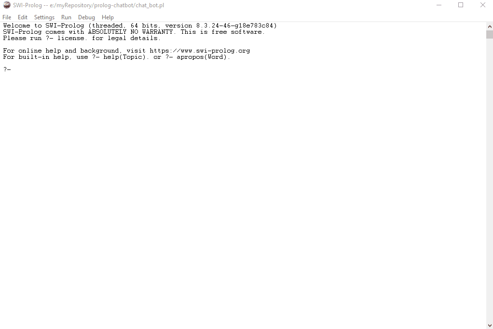

<h1 align="center">
   
  Chatbot
   
</h1>

Perguntas e Resposta - Prolog

 
   

## 📅 Sobre

Aplicação acadêmica desenvolvida para critérios de avaliação na Universidade Unifran.

## 🛠 Tecnologias
- [SWI Prolog](https://www.swi-prolog.org/)

## 📝 Licença

Esse projeto está sob a licença MIT. Veja o arquivo [LICENSE](LICENSE) para mais detalhes.

---

 Feito com 💜 by Jhonatan Bergmann

